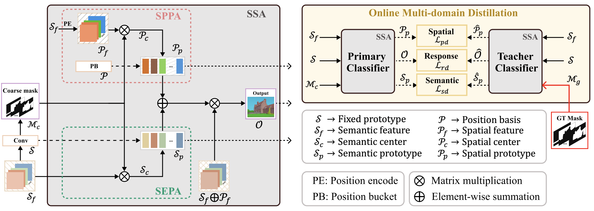

## Paper

> Title: Semantic and Spatial Adaptive Pixel-level Classifier for Semantic Segmentation <br>
> Authors: Xiaowen Ma, Zhenliang Ni and Xinghao Chen <br>
> Citation:
> 
> ```
>   @misc{ma2024semantic,
      title={Semantic and Spatial Adaptive Pixel-level Classifier for Semantic Segmentation}, 
      author={Xiaowen Ma and Zhenliang Ni and Xinghao Chen},
      year={2024},
      eprint={2405.06525},
      archivePrefix={arXiv},
      primaryClass={cs.CV}
}
>   ```

## The overall architecture of SSA



SSA has three key parts: semantic prototype adaptation (SEPA), spatial prototype adaptation (SPPA), and online multi-domain distillation. 

## Models

#### ADE20K

**Iters:** 160000	**Input size:** 512x512	**Batch size:** 16

- General models

  |   +SSA    |                           Backbone                           | Latency (ms) | Flops (G) | mIoU (ss) |
  | :-------: | :----------------------------------------------------------: | :----------: | :-------: | :-------: |
  |  OCRNet   | [HRNet-W48](https://download.openmmlab.com/pretrain/third_party/hrnetv2_w48-d2186c55.pth) |     69.3     |   165.0   |   47.67   |
  |  UperNet  | [Swin-T](https://download.openmmlab.com/mmsegmentation/v0.5/pretrain/swin/swin_tiny_patch4_window7_224_20220317-1cdeb081.pth) |     54.3     |   236.3   |   47.56   |
  | SegFormer | [MiT-B5](https://download.openmmlab.com/mmsegmentation/v0.5/pretrain/segformer/mit_b5_20220624-658746d9.pth) |     70.1     |   52.6    |   50.74   |
  |  UperNet  | [Swin-L](https://download.openmmlab.com/mmsegmentation/v0.5/pretrain/swin/swin_large_patch4_window7_224_22k_20220412-aeecf2aa.pth) |    107.3     |   405.2   |   52.69   |

- Light weight models

  |    +SSA     |                           Backbone                           | Iters  | Latency (ms) | Flops (G) | mIoU (ss) |
  | :---------: | :----------------------------------------------------------: | :----: | :----------: | :-------: | :-------: |
  | AFFormer-B  | [AFFormer-B](https://github.com/dongbo811/AFFormer?tab=readme-ov-file) | 160000 |     26.0     |    4.4    |   42.74   |
  | SeaFormer-B | [SeaFormer-B](https://github.com/fudan-zvg/SeaFormer/tree/main/seaformer-cls) | 160000 |     27.3     |    1.8    |   42.46   |
  |  SegNext-T  | [MSCAN-T](https://download.openmmlab.com/mmsegmentation/v0.5/pretrain/segnext/mscan_t_20230227-119e8c9f.pth) | 160000 |     23.3     |    6.3    |   43.90   |
  | SeaFormer-L | [SeaFormer-L](https://github.com/fudan-zvg/SeaFormer/tree/main/seaformer-cls) | 160000 |     29.9     |    6.4    |   45.36   |

#### COCO-Stuff-10K

**Iters:** 80000	**Input size:** 512x512	**Batch size:** 16

- General models

  |   +SSA    |                           Backbone                           | Latency (ms) | Flops (G) | mIoU (ss) |
  | :-------: | :----------------------------------------------------------: | :----------: | :-------: | :-------: |
  |  OCRNet   | [HRNet-W48](https://download.openmmlab.com/pretrain/third_party/hrnetv2_w48-d2186c55.pth) |     69.3     |   165.0   |   37.94   |
  |  UperNet  | [Swin-T](https://download.openmmlab.com/mmsegmentation/v0.5/pretrain/swin/swin_tiny_patch4_window7_224_20220317-1cdeb081.pth) |     54.3     |   236.3   |   42.30   |
  | SegFormer | [MiT-B5](https://download.openmmlab.com/mmsegmentation/v0.5/pretrain/segformer/mit_b5_20220624-658746d9.pth) |     70.1     |   52.6    |   45.55   |
  |  UperNet  | [Swin-L](https://download.openmmlab.com/mmsegmentation/v0.5/pretrain/swin/swin_large_patch4_window7_224_22k_20220412-aeecf2aa.pth) |    107.3     |   405.2   |   48.94   |

- Light weight models

  |    +SSA     |                           Backbone                           | Iters | Latency (ms) | Flops (G) | mIoU (ss) |
  | :---------: | :----------------------------------------------------------: | :---: | :----------: | :-------: | :-------: |
  | AFFormer-B  | [AFFormer-B](https://github.com/dongbo811/AFFormer?tab=readme-ov-file) | 80000 |     26.0     |    4.4    |   36.40   |
  | SeaFormer-B | [SeaFormer-B](https://github.com/fudan-zvg/SeaFormer/tree/main/seaformer-cls) | 80000 |     27.3     |    1.8    |   35.92   |
  |  SegNext-T  | [MSCAN-T](https://download.openmmlab.com/mmsegmentation/v0.5/pretrain/segnext/mscan_t_20230227-119e8c9f.pth) | 80000 |     23.3     |    6.3    |   38.91   |
  | SeaFormer-L | [SeaFormer-L](https://github.com/fudan-zvg/SeaFormer/tree/main/seaformer-cls) | 80000 |     29.9     |    6.4    |   38.48   |

#### PASCAL-Context

**Iters:** 80000	**Input size:** 480x480	**Batch size:** 16

- General models

  |   +SSA    |                           Backbone                           | Latency (ms) | Flops (G) | mIoU (ss) |
  | :-------: | :----------------------------------------------------------: | :----------: | :-------: | :-------: |
  |  OCRNet   | [HRNet-W48](https://download.openmmlab.com/pretrain/third_party/hrnetv2_w48-d2186c55.pth) |     69.3     |   143.3   |   50.21   |
  |  UperNet  | [Swin-T](https://download.openmmlab.com/mmsegmentation/v0.5/pretrain/swin/swin_tiny_patch4_window7_224_20220317-1cdeb081.pth) |     54.3     |   207.7   |   55.11   |
  | SegFormer | [MiT-B5](https://download.openmmlab.com/mmsegmentation/v0.5/pretrain/segformer/mit_b5_20220624-658746d9.pth) |     70.1     |   45.8    |   59.14   |
  |  UperNet  | [Swin-L](https://download.openmmlab.com/mmsegmentation/v0.5/pretrain/swin/swin_large_patch4_window7_224_22k_20220412-aeecf2aa.pth) |    107.3     |   363.2   |   61.83   |

- Light weight models

  |    +SSA     |                           Backbone                           | Latency (ms) | Flops (G) | mIoU (ss) |
  | :---------: | :----------------------------------------------------------: | :----------: | :-------: | :-------: |
  | AFFormer-B  | [AFFormer-B](https://github.com/dongbo811/AFFormer?tab=readme-ov-file) |     26.0     |    4.4    |   49.72   |
  | SeaFormer-B | [SeaFormer-B](https://github.com/fudan-zvg/SeaFormer/tree/main/seaformer-cls) |     27.3     |    1.8    |   47.00   |
  |  SegNext-T  | [MSCAN-T](https://download.openmmlab.com/mmsegmentation/v0.5/pretrain/segnext/mscan_t_20230227-119e8c9f.pth) |     23.3     |    6.3    |   52.58   |
  | SeaFormer-L | [SeaFormer-L](https://github.com/fudan-zvg/SeaFormer/tree/main/seaformer-cls) |     29.9     |    6.4    |   49.66   |

## Get Started

- Environment

  ```shell
  conda create --name ssa python=3.8 -y
  conda activate ssa
  pip install torch==1.8.2+cu102 torchvision==0.9.2+cu102 torchaudio==0.8.2
  pip install timm==0.6.13
  pip install mmcv-full==1.7.0
  pip install opencv-python==4.1.2.30
  pip install "mmsegmentation==0.30.0"
  ```

  SSA is built based on [mmsegmentation-0.30.0](https://github.com/open-mmlab/mmsegmentation/tree/v0.30.0), which can be referenced for data preparation.

- Train

  ```shell
  # Single-gpu training
  python train.py configs/swin/upernet_swin_tiny_ade20k_ssa.py
  
  # Multi-gpu (4-gpu) training
  bash dist_train.sh configs/swin/upernet_swin_tiny_ade20k_ssa.py 4
  ```

- Test

  ```shell
  # Single-gpu testing
  python test.py configs/swin/upernet_swin_tiny_ade20k_ssa.py ${CHECKPOINT_FILE} --eval mIoU
  
  # Multi-gpu (4-gpu) testing
  bash dist_test.sh configs/swin/upernet_swin_tiny_ade20k_ssa.py ${CHECKPOINT_FILE} 4 --eval mIoU
  ```

- Benchmark

  ```shell
  python benchmark.py configs/swin/upernet_swin_tiny_ade20k_ssa.py ${CHECKPOINT_FILE} --repeat-times 5
  ```

## Acknowledgment

Thanks to previous open-sourced repo:\
[SeaFormer](https://github.com/fudan-zvg/SeaFormer/tree/main) [CAC](https://github.com/tianzhuotao/CAC) [AFFormer](https://github.com/dongbo811/AFFormer) [SegNeXt](https://github.com/Visual-Attention-Network/SegNeXt)\
[mmsegmentation](https://github.com/open-mmlab/mmsegmentation/tree/v0.30.0)

